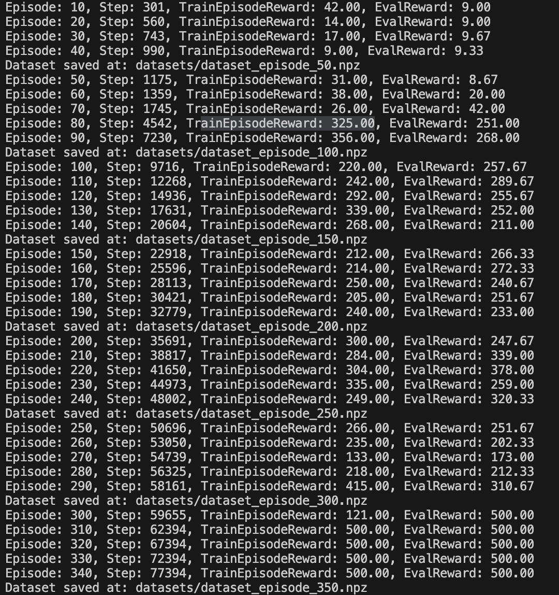

<!-- README.MD File -->

## 文件说明
- **`rl_hw3_demo.py`**  
  本文件为采集训练数据的专家算法脚本，生成基于专家策略的数据集。

- **`dataset_episode_*.npz`**  
  这些文件是采集到的训练数据集，每个文件对应不同的训练集规模或质量。具体的奖励结果如下图所示。
  

- **`environment.yml`**
  请使用如下的推荐环境

# Reinforcement Learning Assignment 3

---

## Offline Reinforcement Learning

### Definition:
- Offline reinforcement learning trains policies using a fixed, pre-collected dataset without interacting with the environment.

### Key Characteristics:
- The data is static and typically generated by other policies or experts.
- No online exploration is required, reducing sampling costs and potential risks.

### Challenges:
- **Distribution Shift**: The training data may differ from the data used during policy evaluation.
- **Data Quality Issues**: The dataset may contain noise or suboptimal behavior.

### Application Scenarios:
- Fields requiring high safety and low exploration costs, such as medical decision-making, robotic learning, and recommendation systems.

---

## CQL: Conservative Q-Learning Algorithm

### Core Idea:
- In offline scenarios, the dataset is usually generated by a limited set of policies. Using standard Q-learning methods directly may lead to overestimation of state-action pairs that appear infrequently or are out-of-distribution (OOD).
- To prevent the policy from "overfitting" by exploiting these OOD actions, CQL introduces a "conservative term" in the objective function, reducing the Q-value estimates for OOD actions during Q function updates.

### Advantages:
- By suppressing overly optimistic estimates of rare or OOD actions, the policy becomes more conservative, ensuring that the learned policy does not rely on OOD actions to achieve unrealistically high rewards, especially when new data cannot be collected.

---

## Loss Function and Optimization Objective in CQL

### Overall Structure of the Q Function:

\[
\min_{Q} \max_{\mu} \alpha \left( \mathbb{E}_{s \sim D, a \sim \mu(a|s)} \left[ Q(s, a) \right] - \mathbb{E}_{s \sim D, a \sim \hat{\pi}_\beta(a|s)} \left[ Q(s, a) \right] \right) + \frac{1}{2} \mathbb{E}_{s,a,s' \sim D} \left[ \left( Q(s, a) - \hat{B}_\pi Q(s, a) \right)^2 \right] + R(\mu).
\]

- **Symbol Definitions**:
  - \(D\): Offline dataset;
  - \(\hat{\pi}_\beta\): The estimated or prior "behavior policy";
  - \(\mu\): The learning policy currently being optimized.

- Starting from the standard Bellman error in Q-learning, to avoid overestimation of out-of-distribution actions, a conservative term is introduced, with \(\alpha\) controlling the degree of conservativeness.
- While minimizing the Bellman error, a regularization term \(R(\mu)\) is applied to ensure that the resulting policy does not deviate excessively from the feasible data distribution.

---

## Introduction to the CartPole-v1 Environment

### Characteristics:
- **Task Objective**: Control a cart by applying forces to the left or right, keeping the pole upright and preventing it from falling.
- **State Space**: Consists of 4 continuous variables:
  - The cart’s position \(x\);
  - The cart’s velocity \(\dot{x}\);
  - The pole’s angle \(\theta\);
  - The pole’s angular velocity \(\dot{\theta}\).
- **Action Space**: A discrete action space {0, 1}:
  - 0: Apply force to the left;
  - 1: Apply force to the right.
- **Reward Function**: A reward of +1 is given for every timestep the pole remains upright (\(|\theta| < 12^\circ\) and \(|x| < 2.4\)). Otherwise, the episode ends.
- **Termination Conditions**:
  - The pole’s angle exceeds 12°;
  - The cart’s position exceeds the track boundaries (\(|x| > 2.4\));
  - The cumulative timestep reaches the maximum value of 500.

---

## Assignment Requirements (100 Points, Weighted into Final Course Grade)

### Requirements:
1. **Algorithm Implementation and Training (40 points)**:
   - Implement the CQL algorithm.
   - Tune training parameters and record the training results.

2. **Code Explanation (20 points)**:
   - Provide a detailed explanation of the key steps and logic in the code implementation in the experiment report.

3. **Experiment Report Analysis (40 points)**:
   - Compare the training results of the CQL algorithm and the standard Q-learning algorithm.
   - Evaluate the impact of different datasets on training results (e.g., by reducing the dataset size through sampling or using suboptimal datasets for experiments).
   - Analyze the effect of different parameters in the Q-function formulation on the training results of the CQL algorithm.

4. **Extra Credit (Bonus, choose one)**:
   - Implement the Behavior Cloning (BC) algorithm.
   - Or implement the BCQ algorithm in offline reinforcement learning.
   - Record at least one experimental result using the `dataset_episode_350.npz` dataset.

---

## Assignment Submission Requirements

- **Submission Deadline**: January 17, 2025, 23:59:59 (UTC+8).
- **Submission Method**: Submit through the BB (Blackboard) platform.
- **Submission Requirements**:
  - Files must be submitted in `.zip` format.
  - The compressed file must include:
    - At least one code file.
    - An experiment report (must be in PDF format, writing style is flexible).
  - File naming format: `<STUDENT_ID>_<NAME>_exp3.zip` (Student ID must be in uppercase).  
    Example: `SA23011281_ZhouShuhang_exp3.zip`.

**Note**: Ensure the submission is complete and follows the naming conventions to avoid affecting your grade.

  